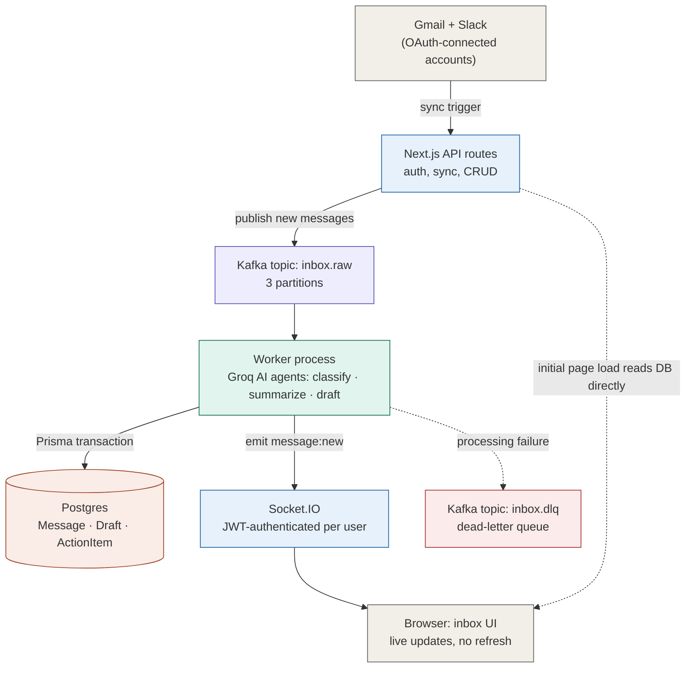
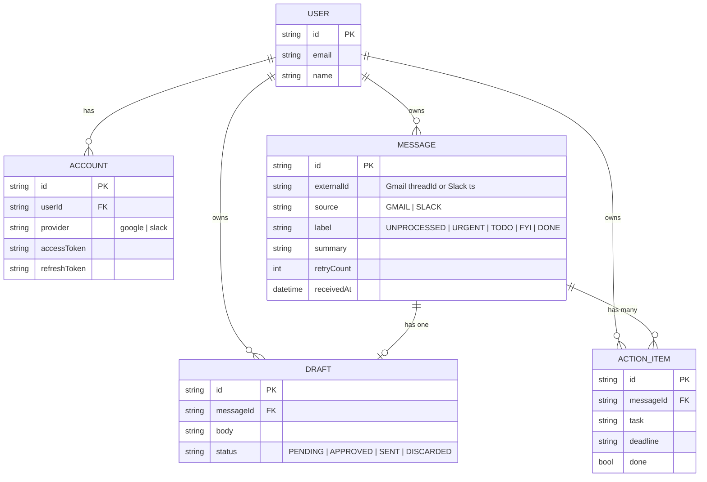

<div align="center">

# 📬 AI Unified Inbox

**One inbox for Gmail and Slack — triaged, summarized, and drafted by AI in real time.**

[](https://nextjs.org)
[](https://www.typescriptlang.org)
[](https://kafka.apache.org)
[](https://www.postgresql.org)
[](https://groq.com)
[](#license)

[Overview](#-overview) · [Architecture](#-architecture) · [Getting started](#-getting-started) · [Environment variables](#-environment-variables) · [API reference](#-api-reference) · [Security](#-security)

</div>

---

## 📖 Overview

**AI Unified Inbox** pulls your Gmail threads and Slack messages into a single feed, then uses an LLM pipeline to:

- 🏷️ **Classify** every message as `Urgent`, `To-do`, or `FYI`
- 📝 **Summarize** it in one precise sentence
- ✅ **Extract action items** with deadlines
- ✍️ **Draft a reply** automatically, ready to edit and send
- 🔁 **Revise drafts** with a plain-English instruction ("make it shorter", "more formal")
- ⚡ **Push everything live** to the browser the moment it's ready — no polling, no refresh

It's built as an event-driven system, not a CRUD app with an LLM call bolted on: ingestion, AI processing, and the UI are three independently-scalable pieces connected by Kafka and WebSockets.

<details>
<summary><strong>▶ Why the AI pipeline is structured this way (click to expand)</strong></summary>

<br>

Every incoming message goes through two Groq calls, orchestrated as a small agent pipeline rather than one giant prompt:

| Agent | Model | Job |
|---|---|---|
| `analyzeMessageAgent` | `llama-3.3-70b-versatile` | Classification + summary + action-item extraction in one structured call |
| `replyDrafterAgent` | `llama-3.1-8b-instant` | Drafts a reply, skipped entirely for `FYI` messages to save latency/cost |
| `reviseDraftAgent` | `llama-3.1-8b-instant` | Rewrites an existing draft given a user instruction |

All three responses are validated through **Zod schemas with safe fallbacks** — a malformed or empty LLM response never crashes the pipeline, it just degrades to a sane default (e.g. `FYI` + "No summary available").

</details>

---

## 🏗️ Architecture



**Why Kafka sits in the middle:** sync (`POST /api/gmail`, `POST /api/slack`) stays fast — it just fetches new messages and publishes them. The expensive part (two LLM calls per message) happens in a separate, independently-scalable **worker** process that consumes `inbox.raw`. If the worker is down, messages queue in Kafka instead of failing the sync request. If AI processing fails for a specific message, it's rerouted to a **dead-letter queue** (`inbox.dlq`) instead of being lost, and a background sweep (`reprocessStuck`) retries anything left in `UNPROCESSED` state on worker boot, up to 3 attempts.

### Data model



### Request lifecycle: a new email arrives

1. User (or Google Pub/Sub webhook) triggers `POST /api/gmail`.
2. Route fetches recent threads, dedupes against Postgres by `externalId`, publishes new ones to `inbox.raw`.
3. Worker consumes the message, immediately writes it as `UNPROCESSED` (UI shows a spinner instantly), and calls the AI pipeline.
4. Classification, summary, action items, and (if not `FYI`) a draft reply are written back inside a single Prisma `$transaction`.
5. The enriched message is emitted over a JWT-authenticated Socket.IO room (`user:<id>`) — every open tab for that user updates instantly, no refresh.
6. On failure at any point, the raw payload is sent to `inbox.dlq` and the message is gracefully marked `FYI` with an error summary instead of spinning forever.

---

## ✨ Features

- 🔀 **Unified feed** — Gmail threads and Slack messages in one place, filterable by label and source
- 🧠 **AI triage** — automatic Urgent / To-do / FYI classification with a one-line summary
- ✅ **Action item extraction** — tasks with deadlines pulled straight out of message bodies
- ✍️ **AI-drafted replies** — sent through the real Gmail/Slack API, not a mock
- 🗣️ **Conversational draft revision** — "make it shorter" rewrites the draft in place
- ⚡ **Real-time sync** — Socket.IO pushes updates the moment the AI pipeline finishes
- ♻️ **Resilient pipeline** — dead-letter queue, capped retries, idempotent message ingestion
- 🔐 **Per-user JWT-authenticated WebSockets** — a socket can only ever act as the user it authenticated as
- 🐳 **Dockerized** — `docker-compose up` runs Postgres, the web app, and the worker together

---

## 🧱 Tech stack

| Layer | Technology |
|---|---|
| Frontend | Next.js 16 (App Router), React 19, Tailwind CSS |
| Backend API | Next.js Route Handlers |
| Auth | NextAuth (Google OAuth) + manual Slack OAuth flow |
| Messaging | Kafka (KafkaJS) — event-driven ingestion pipeline |
| AI | Groq (`llama-3.3-70b-versatile`, `llama-3.1-8b-instant`) via `groq-sdk`, validated with Zod |
| Database | PostgreSQL via Prisma ORM |
| Real-time | Socket.IO, JWT-authenticated per connection |
| Integrations | Gmail API (`googleapis`), Slack Web API (`@slack/web-api`) |
| Infra | Docker / docker-compose |

---

## 🚀 Getting started

### Prerequisites

- Node.js 20+
- A running Postgres instance
- A running Kafka broker (local via Homebrew/Docker, or a Confluent Cloud cluster)
- Google Cloud OAuth credentials with the Gmail API enabled
- A Slack app with OAuth scopes configured
- A [Groq](https://console.groq.com) API key

### Local setup

```bash
# 1. Install dependencies
npm install

# 2. Configure environment variables
cp .env.example .env   # then fill in the values — see table below

# 3. Push the Prisma schema to your database
npx prisma generate
npx prisma db push

# 4. Run the web app and the worker in two terminals
npm run dev       # Next.js app → http://localhost:3000
npm run worker    # Kafka consumer + Socket.IO server → ws://localhost:3001
```

### Docker setup

```bash
docker compose up --build
```

This starts three services: `postgres`, `web` (Next.js on port 3000), and `worker` (Kafka consumer + Socket.IO on port 3001). See `docker-compose.yml` for the full service definition.

---

## 🔑 Environment variables

| Variable | Required | Description |
|---|---|---|
| `DATABASE_URL` | ✅ | Postgres connection string |
| `NEXTAUTH_URL` | ✅ | Base URL of the web app (e.g. `http://localhost:3000`); also used to lock down Socket.IO CORS |
| `NEXTAUTH_SECRET` | ✅ | Signs NextAuth sessions **and** the short-lived Socket.IO auth tokens — generate with `openssl rand -base64 32` |
| `GOOGLE_CLIENT_ID` / `GOOGLE_CLIENT_SECRET` | ✅ | Google OAuth app credentials with Gmail scopes |
| `SLACK_CLIENT_ID` / `SLACK_CLIENT_SECRET` | for Slack | Slack app OAuth credentials |
| `SLACK_SIGNING_SECRET` / `SLACK_BOT_TOKEN` | for Slack | Used for Slack app verification |
| `GROQ_API_KEY` | ✅ | Groq API key for all three AI agents |
| `KAFKA_BROKER` | ✅ | Kafka bootstrap broker, e.g. `localhost:9092` |
| `KAFKA_USERNAME` / `KAFKA_PASSWORD` | for Confluent Cloud | Enables SASL/SSL; also switches default replication factor to 3 |
| `KAFKA_REPLICATION_FACTOR` | optional | Overrides the auto-detected replication factor |
| `WS_PORT` | optional | Port the worker's Socket.IO server listens on (default `3001`) |
| `NEXT_PUBLIC_WS_URL` | ✅ | URL the browser connects to for Socket.IO (e.g. `http://localhost:3001`) |

> No separate secret is needed for WebSocket auth — it reuses `NEXTAUTH_SECRET` so there's one fewer credential to provision and rotate.

---

## 📁 Project structure

```
ai-unified-inbox/
├─ lib/
│  ├─ auth/config.ts        # NextAuth config, Google OAuth scopes, session callbacks
│  ├─ db/client.ts          # Prisma client singleton
│  ├─ gmail.ts              # Gmail thread fetch/parse, token refresh, send reply
│  ├─ slack.ts              # Slack message fetch, send reply
│  ├─ kafka/
│  │  ├─ client.ts          # Producer, topic definitions, ensureTopics()
│  │  └─ worker.ts          # Kafka consumer + AI pipeline + Socket.IO server
│  ├─ groq/agents.ts        # analyzeMessageAgent, replyDrafterAgent, reviseDraftAgent
│  └─ utils/
│     ├─ pLimit.ts          # Minimal concurrency limiter
│     └─ rateLimit.ts       # In-memory sliding-window rate limiter
├─ prisma/schema.prisma     # User, Account, Message, Draft, ActionItem models
├─ src/
│  ├─ app/
│  │  ├─ api/               # Route handlers (see API reference below)
│  │  ├─ inbox/             # Main authenticated inbox page
│  │  ├─ login/             # Sign-in page
│  │  └─ settings/          # Connect Gmail/Slack, manage integrations
│  ├─ components/
│  │  ├─ inbox/             # InboxClient, MessageList, MessageDetail, Sidebar, StatsBar
│  │  └─ settings/          # SettingsClient
│  └─ middleware.ts         # Route protection for /inbox and /settings
├─ docker-compose.yml
└─ Dockerfile
```

---

## 📡 API reference

| Method | Route | Description |
|---|---|---|
| `POST` | `/api/gmail` | Trigger a Gmail sync (rate-limited to 1 / 20s per user) or handle the Google Pub/Sub webhook |
| `GET` | `/api/slack` | Redirect to Slack OAuth consent screen |
| `POST` | `/api/slack` | Trigger a Slack sync (rate-limited to 1 / 20s per user) |
| `GET` | `/api/slack/callback` | Slack OAuth callback, stores the access token |
| `GET` | `/api/messages` | List messages, filterable by `label` and `source`, cursor-paginated |
| `PATCH` | `/api/messages/:id` | Update `label` or `isRead` |
| `PATCH` | `/api/draft/:id` | Edit a draft's body |
| `DELETE` | `/api/draft/:id` | Discard a draft |
| `POST` | `/api/draft/:id/send` | Send the draft via Gmail or Slack, marks message `DONE` |
| `POST` | `/api/draft/:id/revise` | AI-revise a draft given a plain-English instruction |
| `PATCH` | `/api/actions/:id` | Update an action item (`done`, `task`, `deadline`) |
| `DELETE` | `/api/actions/:id` | Remove an action item |
| `GET` | `/api/socket-token` | Issues a short-lived JWT for the browser's Socket.IO handshake |

All routes except the Gmail webhook and OAuth callbacks require a valid NextAuth session, and every DB mutation is scoped with `where: { id, userId }` so a user can only ever touch their own data.

---

## 🔐 Security

- **Authenticated WebSockets** — every Socket.IO connection presents a short-lived JWT (`/api/socket-token`, 5-minute expiry, signed with `NEXTAUTH_SECRET`). The worker verifies it in an `io.use()` middleware and derives `userId` from the token — never from client-supplied data — before joining any room or executing any mutation.
- **Locked-down CORS** — the Socket.IO server only accepts connections from `NEXTAUTH_URL`, not `*`.
- **Rate-limited sync endpoints** — `/api/gmail` and `/api/slack` cap manual syncs to 1 per 20 seconds per user to protect Gmail/Groq API quota.
- **Row-level authorization** — every Prisma mutation filters on `{ id, userId }`, so even a valid session can't read or modify another user's rows.
- **Zod-validated AI output** — every LLM response is parsed through a schema with safe fallbacks, so a malformed or adversarial model response can't corrupt application state.

---

## 🗺️ Roadmap

- [ ] Semantic search over message history (pgvector + embeddings)
- [ ] User-defined auto-labeling rules layered on top of AI classification
- [ ] Confidence-gated drafting — skip auto-draft when the classifier isn't confident
- [ ] Scheduled daily/weekly AI digest
- [ ] Snooze and follow-up reminders
- [ ] Shared/team inbox support
- [ ] Automated test suite (Vitest) for the AI pipeline and API routes

---

## 📄 License

MIT
